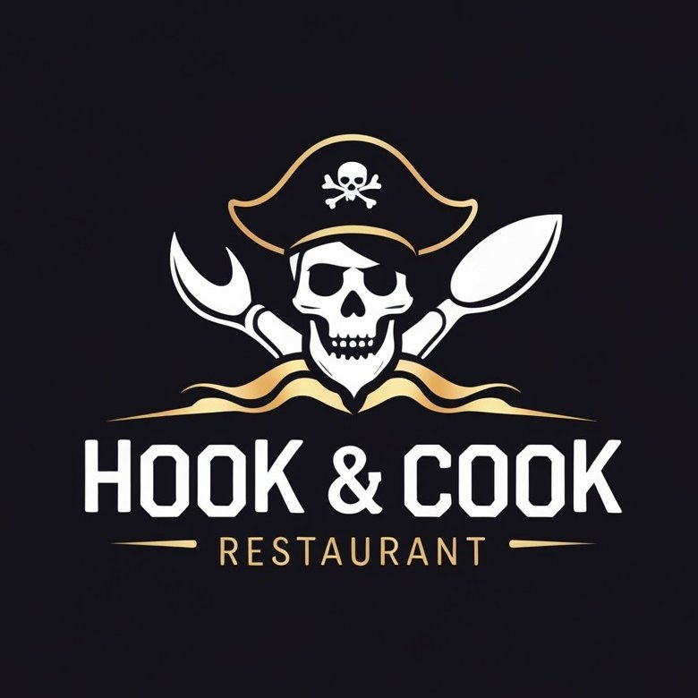

<a id="readme-top"></a>

<!-- PROJECT LOGO -->
<br />
<div align="center">
  <a href="https://github.com/franbtt/restaurant-page">
    
  </a>

  <h3 align="center">Hook & Cook</h3>

  <p align="center">
    A pirate-themed restaurant page built with:
    <br />
    <br />
    
    
    
    
    <br />
    <br />
    <a href="https://batetdev.github.io/top-project-restaurant-page/">Live Demo</a>
    ·
    <a href="https://github.com/BatetDev/top-project-restaurant-page/tree/main">View Code</a>
  </p>
</div>

## About

A simple restaurant page created as part of The Odin Project's JavaScript course. The project focuses on using Webpack to bundle modules and manage assets.

### Key Features

- Dynamic content loading using JavaScript modules
- Webpack configuration for bundling and asset management
- Responsive design with a pirate theme
- Tab-based navigation between pages

### Built With

- HTML5 for structure
- CSS3 for styling
- JavaScript for dynamic content
- Webpack for bundling

## Getting Started

```bash
# Clone the repository
git clone https://github.com/BatetDev/top-project-restaurant-page/tree/main

# Navigate to project directory
cd top-project-restaurant-page

# Install dependencies
npm install

# Run development server
npm run dev

# Build for production
npm run build
```
